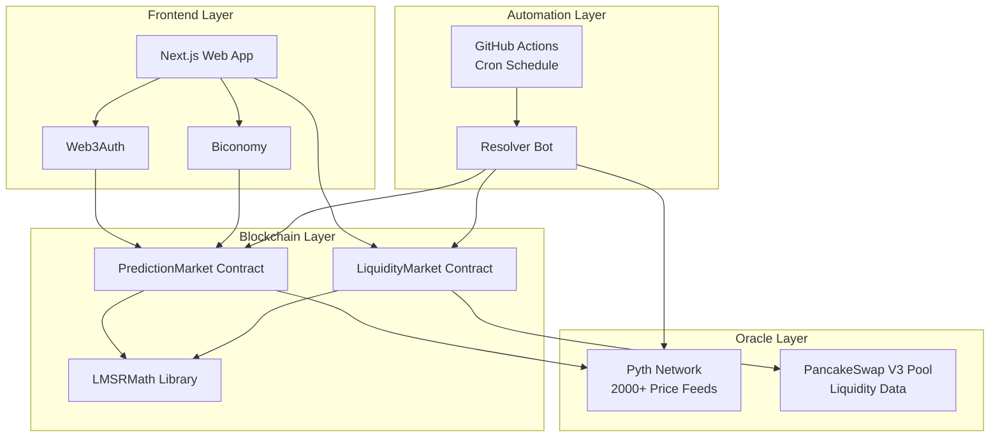
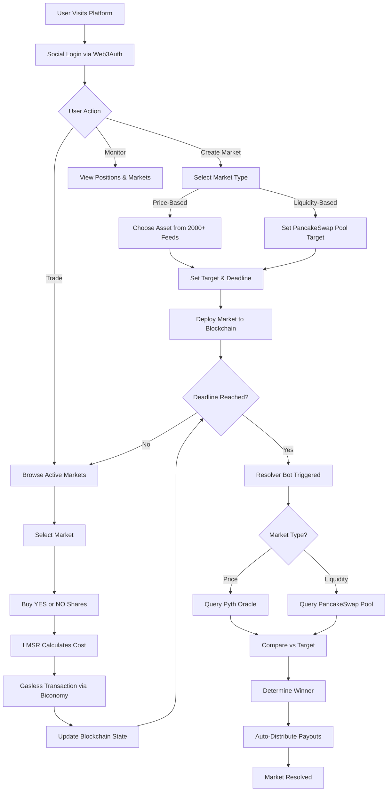

<div align="center">
  

# Chartor Prediction Market....
  
  A decentralized prediction market platform built on Binance Smart Chain, featuring automated market making, social authentication and automated market resolution..
  
</div>


## Overview

This platform enables users to create and trade on prediction markets for various assets and events. It combines smart contracts for on-chain logic, a modern web interface for user interaction, and an automated bot for market resolution. The system supports price-based predictions across 2000+ assets via Pyth Network oracles and liquidity-based predictions using PancakeSwap pool data.

## Key Features

- Binary prediction markets (YES/NO outcomes)
- Automated market making using Logarithmic Market Scoring Rule (LMSR)
- Support for 2000+ assets (crypto, forex, commodities, stocks, indices)
- PancakeSwap liquidity-based markets
- Social login with Web3Auth (no wallet required)
- Automated market resolution and payout distribution
- Real-time price charts with TradingView integration
- Whale tracking and activity monitoring
- GitHub Actions automated resolution bot

## Platform Architecture



## System Workflow



## Components

### 1. Smart Contracts

The blockchain layer consists of Solidity smart contracts deployed on BNB testnet.

**Key Contracts:**

- **PredictionMarket**: Manages price-based prediction markets with Pyth oracle integration
- **LiquidityMarket**: Handles liquidity-based markets with PancakeSwap integration
- **LMSRMath**: Mathematical library for automated market making calculations

**Features:**

- LMSR-based automated pricing
- Multi-market support in single contract
- Whale tracking and participant management
- Automatic payout distribution
- Platform fee collection (1.5%)
- Emergency admin functions

[View Contracts Documentation →](./contract/README.md)

### 2. Frontend Application

Modern web interface built with Next.js and React for seamless user experience.

**Key Features:**

- Social authentication (Google, Twitter, Discord, etc.)
- Gasless transactions for better UX
- Real-time market data and charts
- Market creation wizard
- Trading interface with live pricing
- Position management dashboard
- Responsive design with dark mode

[View Frontend Documentation →](./frontend/README.md)

### 3. Resolver Bot

Automated bot for resolving expired markets and distributing payouts.

**Key Features:**

- Monitors expired markets continuously
- Updates Pyth price feeds before resolution
- Triggers market resolution on-chain
- Handles both market types automatically
- Comprehensive logging and error handling
- GitHub Actions integration for scheduling

[View Resolver Bot Documentation →](./resolver_bot/README.md)

## How It Works

### Market Creation

1. User authenticates via Web3Auth (social login)
2. Selects market type (Price-based or Liquidity-based)
3. Configures parameters:
   - Asset/Pool selection
   - Target price/liquidity
   - Market deadline
   - Liquidity parameter for LMSR
4. Transaction submitted via Biconomy (gasless)
5. Market created on blockchain

### Trading Phase

1. Users browse active markets
2. View current prices calculated by LMSR
3. Purchase YES or NO shares
4. LMSR automatically adjusts prices based on demand
5. Platform collects 1.5% fee
6. Whale bets are tracked and displayed
7. All transactions are gasless via Biconomy

### Market Resolution

1. Market deadline passes
2. Resolver bot detects expired market (runs hourly)
3. For price-based markets:
   - Fetches latest price from Pyth Hermes API
   - Updates Pyth oracle on-chain
   - Calls resolveMarket() function
   - Contract compares price vs target
4. For liquidity-based markets:
   - Calls resolveMarket() function
   - Contract queries PancakeSwap pool
   - Compares liquidity vs target
5. Winner determined (YES or NO)
6. Payouts automatically distributed proportionally
7. Market marked as resolved

### Payout Distribution

- Winners receive proportional share of market balance
- Formula: `(userShares / totalWinningShares) × marketBalance`
- Automatic distribution during resolution
- No manual claim required
- Platform fees separated and withdrawable by owner

## Technology Stack

### Blockchain

- Binance Smart Chain (Testnet)
- Solidity 0.8.20
- Hardhat
- Ethers.js v6

### Oracles & Data

- Pyth Network (2000+ price feeds)
- PancakeSwap V3 (liquidity data)

### Frontend

- Next.js 16
- React 19
- TypeScript
- Wagmi & Viem
- Web3Auth
- Biconomy

### Backend/Automation

- Node.js
- GitHub Actions
- Cron scheduling

### Development Tools

- Git & GitHub
- ESLint & Prettier
- Hardhat testing framework
- TypeScript compiler

## Getting Started

### Prerequisites

- Node.js 18 or higher
- npm or yarn
- Git
- BNB testnet tokens
- Web3Auth Client ID
- Biconomy API key

### Quick Start

Clone the repository:

```bash
git clone https://github.com/HoomanDigital/chartor-prediction-market.git
cd chartor-prediction-market
```

Each component requires specific environment variables. Refer to individual README files for detailed configuration instructions:

- [Contract Configuration](./contract/README.md#configuration)
- [Frontend Configuration](./frontend/README.md#configuration)
- [Resolver Bot Configuration](./resolver_bot/README.md#configuration)

## Project Structure

```
prediction-market-platform/
├── contract/              # Smart contracts
│   ├── contracts/        # Solidity source files
│   ├── deploy/          # Deployment scripts
│   ├── test/            # Contract tests
│   └── README.md        # Contract documentation
├── frontend/             # Web application
│   ├── app/             # Next.js pages
│   ├── src/             # React components & logic
│   └── README.md        # Frontend documentation
├── resolver_bot/         # Automated resolver
│   ├── src/             # Bot source code
│   └── README.md        # Bot documentation
├── .github/
│   └── workflows/       # GitHub Actions
└── README.md            # This file
```

## Network Information

### BNB Testnet

- Chain ID: 97
- RPC URL: https://data-seed-prebsc-1-s1.binance.org:8545/
- Block Explorer: https://testnet.bscscan.com/
- Faucet: https://testnet.bnbchain.org/faucet-smart

### Contract Addresses

Update these after deployment:

- PredictionMarket: `0x145f0B7c4777D05C5326DE723c9087E1cd0C8C68`
- LiquidityMarket: `0xf6686a498d6FF970380d05946Cf10701125Fd2B0`

## Key Concepts

### LMSR (Logarithmic Market Scoring Rule)

Automated market maker algorithm that:

- Provides instant liquidity
- Adjusts prices based on demand
- Ensures prices sum to 1
- Enables efficient price discovery

Formula: `C(q_yes, q_no) = b × ln(e^(q_yes/b) + e^(q_no/b))`

### Account Abstraction

Biconomy enables:

- Gasless transactions for users
- Better onboarding experience
- Sponsored transaction fees
- No need for users to hold BNB

### Oracle Integration

**Pyth Network:**

- Real-time price feeds
- 2000+ supported assets
- Low latency updates
- Cryptographically secure

**PancakeSwap:**

- On-chain liquidity data
- Real-time pool information
- Decentralized data source

## Security Considerations

- Smart contracts use OpenZeppelin standards
- Comprehensive test coverage
- Reentrancy protection
- Access control mechanisms
- Input validation and error handling
- Private key management via environment variables
- Regular dependency updates

## Contributing

Contributions are welcome! Please follow these guidelines:

1. Fork the repository
2. Create a feature branch
3. Make your changes
4. Add tests if applicable
5. Run linters and formatters
6. Submit a pull request

## Roadmap

Future enhancements:

- Mainnet deployment
- Additional oracle integrations
- Advanced market types
- Mobile application
- Multi-language support
- Social features and leaderboards
- Market analytics dashboard

## Acknowledgments

- Pyth Network for price oracle infrastructure
- PancakeSwap for DEX integration
- Web3Auth for authentication solution
- Biconomy for account abstraction
- OpenZeppelin for security standards
- Binance Smart Chain for blockchain infrastructure
