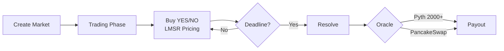

# Prediction Market Smart Contracts

A comprehensive suite of smart contracts for decentralized prediction markets with automated market making and liquidity management capabilities.

## Overview

This project implements a prediction market platform on the Binance Smart Chain (BSC) testnet, featuring automated market making using the Logarithmic Market Scoring Rule (LMSR) algorithm and integration with Pyth Network price oracles for reliable price feeds.

## Architecture

The contract suite consists of three core components:

### PredictionMarket

The main contract managing prediction market creation, trading, and resolution. Supports binary outcome markets with automated pricing through LMSR.

### LiquidityMarket

Handles liquidity provision and management for prediction markets, enabling users to provide liquidity and earn fees from trading activity.

### LMSRMath

Mathematical library implementing the Logarithmic Market Scoring Rule algorithm for automated market making and dynamic pricing.

## System Workflow



## Features

- Binary prediction markets with YES/NO outcomes
- Automated market making using LMSR algorithm
- Integration with Pyth Network price oracles (2000+ price feeds)
- PancakeSwap V3 liquidity-based prediction markets
- Support for crypto, forex, commodities, stocks, and indices
- Whale tracking and participant management
- Automated market resolution and payout distribution
- Platform fee collection (1.5%)
- Gas-optimized operations
- Comprehensive test coverage

## Technology Stack

- Solidity 0.8.20
- Hardhat development environment
- OpenZeppelin contracts for security standards
- Chainlink contracts for oracle integration
- Ethers.js v6 for blockchain interactions
- Pyth Network for price feeds

## Prerequisites

- Node.js (v16 or higher)
- npm or yarn package manager
- MetaMask or compatible Web3 wallet
- BNB testnet tokens for deployment

## Installation

Install project dependencies:

```bash
npm install
```

## Configuration

Create a `.env` file in the contract directory based on `.env.example`:

```
PRIVATE_KEY=your_private_key_here
BNB_TESTNET_RPC_URL=https://data-seed-prebsc-1-s1.binance.org:8545/
ETHERSCAN_API_KEY=your_etherscan_api_key_here
REPORT_GAS=true
```

## Network Configuration

The project supports the following networks:

- Hardhat (local development)
- Localhost (local node)
- BNB Testnet (Chain ID: 97)

Network configurations are managed in `hardhat.config.js` and `helper-hardhat-config.js`.

## Available Scripts

### Compilation

Compile all smart contracts:

```bash
npm run compile
```

### Testing

Run the complete test suite:

```bash
npm run test
```

### Deployment

Deploy contracts to the configured network:

```bash
npm run deploy
```

For specific network deployment:

```bash
npx hardhat deploy --network bnbTestnet
```

### Contract Size Analysis

Check compiled contract sizes:

```bash
npm run size
```

### Code Coverage

Generate test coverage report:

```bash
npm run coverage
```

### Linting

Run Solidity linter:

```bash
npm run lint
```

### Code Formatting

Format code using Prettier:

```bash
npm run format
```

## Project Structure

```
contract/
├── contracts/          # Smart contract source files
├── deploy/            # Deployment scripts
├── test/              # Test files
├── deployments/       # Deployment artifacts
├── artifacts/         # Compiled contract artifacts
├── cache/             # Hardhat cache
├── hardhat.config.js  # Hardhat configuration
└── helper-hardhat-config.js  # Network helper configuration
```

## Testing

The project includes comprehensive test coverage for all contract functionality:

- Unit tests for individual contract functions
- Integration tests for contract interactions
- Testnet deployment verification tests
- LMSR mathematical accuracy tests

Tests are written using Hardhat's testing framework with Chai assertions.

## Deployment

Deployment is managed through Hardhat Deploy plugin, providing:

- Deterministic deployments
- Deployment verification
- Network-specific configurations
- Automated deployment scripts

Deployment artifacts are stored in the `deployments/` directory for each network.

## Gas Optimization

The contracts are optimized for gas efficiency:

- Solidity optimizer enabled (200 runs)
- Efficient data structures
- Minimal storage operations
- Gas reporter integration for analysis

## Security Considerations

- OpenZeppelin security standards implementation
- Comprehensive test coverage
- Reentrancy protection
- Access control mechanisms
- Input validation and error handling

## Oracle Integration

The platform integrates with Pyth Network for reliable price feeds supporting 2000+ assets across multiple categories:

- Crypto: BTC/USD, ETH/USD, BNB/USD, SOL/USD, and 100+ more
- Forex: EUR/USD, GBP/USD, JPY/USD, and major currency pairs
- Commodities: Gold, Silver, Oil, Natural Gas
- Stocks: Major equities and indices
- Custom assets: Any Pyth-supported price feed

The LiquidityMarket contract integrates with PancakeSwap V3 pools for liquidity-based predictions on the BNB/USDT trading pair.

Oracle addresses and feed IDs are configured per network in the helper configuration file.

