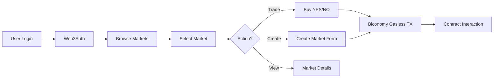

# Prediction Market Frontend

Modern web application for decentralized prediction markets built with Next.js 16, React 19, and Web3 technologies. Provides a seamless user experience for creating, trading, and managing prediction markets on the Binance Smart Chain testnet.

## Overview

The frontend application serves as the primary interface for users to interact with prediction market smart contracts. It features social authentication via Web3Auth, gasless transactions through Biconomy, and real-time market data visualization with TradingView charts.

## Features

- Social login with Web3Auth (Google, Twitter, Discord, etc.)
- Gasless transactions via Biconomy Account Abstraction
- Real-time price charts with TradingView integration
- Support for 2000+ assets via Pyth Network price feeds
- Liquidity-based markets with PancakeSwap integration
- Market creation and management interface
- Live trading with LMSR-based pricing
- Whale tracking and activity monitoring
- Position management and portfolio view
- Responsive design with Tailwind CSS
- Dark mode support
- Toast notifications for user feedback

## Technology Stack

### Core Framework

- Next.js 16 (App Router)
- React 19
- TypeScript 5

### Web3 Integration

- Wagmi 2.x for Ethereum interactions
- Viem 2.x for contract calls
- Web3Auth for social authentication
- Biconomy for gasless transactions

### UI/UX

- Tailwind CSS 4 for styling
- Framer Motion for animations
- Lucide React for icons
- React Hot Toast for notifications
- Shadcn UI components

### State Management

- Zustand for global state
- TanStack Query for server state
- React hooks for local state

### Development Tools

- ESLint for code linting
- Prettier for code formatting
- TypeScript for type safety

## Application Workflow



## Prerequisites

- Node.js 18 or higher
- npm or yarn package manager
- Web3Auth Client ID
- Biconomy API key
- BNB testnet RPC access

## Installation

Install dependencies:

```bash
npm install
```

## Configuration

Create a `.env.local` file based on `.env.example`:

```
NEXT_PUBLIC_WEB3AUTH_CLIENT_ID=your_web3auth_client_id_here
NEXT_PUBLIC_BICONOMY_BUNDLER_URL=https://bundler.biconomy.io/api/v2/97/your_api_key
NEXT_PUBLIC_RPC_URL=https://data-seed-prebsc-1-s1.binance.org:8545/
NEXT_PUBLIC_CHAIN_ID=97
```

### Configuration Parameters

- **NEXT_PUBLIC_WEB3AUTH_CLIENT_ID**: Web3Auth dashboard client ID for social authentication
- **NEXT_PUBLIC_BICONOMY_BUNDLER_URL**: Biconomy bundler endpoint with API key for gasless transactions
- **NEXT_PUBLIC_RPC_URL**: BNB testnet RPC endpoint for blockchain interactions
- **NEXT_PUBLIC_CHAIN_ID**: Network chain ID (97 for BNB testnet)

### Getting API Keys

**Web3Auth**:

1. Visit [Web3Auth Dashboard](https://dashboard.web3auth.io/)
2. Create a new project
3. Copy the Client ID

**Biconomy**:

1. Visit [Biconomy Dashboard](https://dashboard.biconomy.io/)
2. Create a new project for BNB testnet
3. Get the bundler URL with API key

## Available Scripts

### Development

Run the development server:

```bash
npm run dev
```

Open [http://localhost:3000](http://localhost:3000) in your browser.

### Production Build

Build the application for production:

```bash
npm run build
```

### Start Production Server

Run the production build:

```bash
npm start
```

### Linting

Run ESLint:

```bash
npm run lint
```

### Code Formatting

Format code with Prettier:

```bash
npm run format
```

Check formatting:

```bash
npm run format:check
```

## Project Structure

```
frontend/
├── app/                    # Next.js app router pages
│   ├── api/               # API routes
│   ├── markets/           # Market pages
│   ├── positions/         # User positions page
│   ├── layout.tsx         # Root layout
│   └── page.tsx           # Home page
├── src/
│   ├── components/        # React components
│   │   ├── charts/       # TradingView charts
│   │   ├── common/       # Shared components
│   │   ├── layout/       # Layout components
│   │   ├── markets/      # Market components
│   │   ├── positions/    # Position components
│   │   ├── trading/      # Trading components
│   │   ├── ui/           # UI primitives
│   │   ├── web3/         # Web3 components
│   │   └── whales/       # Whale tracking
│   ├── lib/              # Utilities and helpers
│   │   ├── constants/    # Constants and configs
│   │   ├── contracts/    # Contract ABIs and addresses
│   │   ├── hooks/        # Custom React hooks
│   │   ├── utils/        # Utility functions
│   │   └── web3/         # Web3 configuration
│   ├── stores/           # Zustand state stores
│   └── types/            # TypeScript type definitions
├── public/               # Static assets
└── package.json          # Dependencies
```

## Key Features

### Market Creation

Users can create two types of prediction markets:

1. **Price-Based Markets**: Predict if an asset price will reach a target by deadline
   - Support for 2000+ assets via Pyth Network
   - Crypto, forex, commodities, stocks, and indices
   - Custom target price and deadline

2. **Liquidity-Based Markets**: Predict if PancakeSwap pool liquidity will reach a target
   - BNB/USDT pool integration
   - Real-time liquidity tracking
   - Custom target and deadline

### Trading Interface

- Buy YES or NO shares with LMSR pricing
- Real-time price updates
- Cost calculation before purchase
- Gasless transactions via Biconomy
- Transaction status notifications

### Market Visualization

- TradingView charts for price history
- Current market prices (YES/NO)
- Total volume and participants
- Whale activity tracking
- Time remaining until deadline

### Position Management

- View all active positions
- Track potential payouts
- Monitor market outcomes
- Historical performance

## Web3 Integration

### Authentication

Web3Auth provides social login options:

- Google
- Twitter
- Discord
- Email
- And more

Users can authenticate without managing private keys directly.

### Gasless Transactions

Biconomy Account Abstraction enables:

- No gas fees for users
- Seamless onboarding
- Better user experience
- Sponsored transactions

### Contract Interactions

The application interacts with:

- PredictionMarket contract for price-based markets
- LiquidityMarket contract for liquidity-based markets
- Pyth Oracle for price feeds
- PancakeSwap pools for liquidity data

## State Management

### Global State (Zustand)

- **authStore**: User authentication and wallet state
- **marketStore**: Market data and filters

### Server State (TanStack Query)

- Market listings with caching
- Real-time price updates
- Position data synchronization
- Automatic refetching and invalidation

## Styling

The application uses Tailwind CSS 4 with:

- Custom color palette
- Responsive breakpoints
- Dark mode support
- Component variants via CVA
- Utility-first approach


