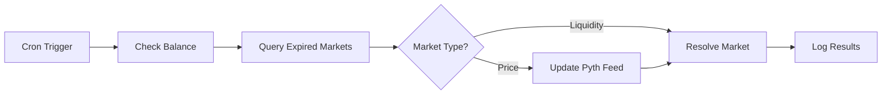

# Prediction Market Resolver Bot

Automated bot for resolving expired prediction markets on the Binance Smart Chain testnet. Monitors both price-based and liquidity-based markets, automatically triggering resolution and payout distribution when deadlines are reached.

## Overview

The resolver bot continuously monitors prediction markets and automatically resolves them after their deadlines expire. It handles Pyth Network price feed updates for price-based markets and queries PancakeSwap pool data for liquidity-based markets.

## Features

- Automatic resolution of expired price-based markets
- Automatic resolution of expired liquidity-based markets
- Pyth Network price feed updates before resolution
- GitHub Actions integration for scheduled execution
- Comprehensive logging and error handling
- Low balance warnings
- Gas-optimized transactions

## Architecture

The bot consists of several components:

- **MarketResolver**: Core resolution logic for both market types
- **Config**: Environment-based configuration management
- **Logger**: Structured logging with multiple levels
- **ABIs**: Contract interface definitions
- **Cron**: Scheduled execution handler

## Workflow



## Prerequisites

- Node.js (v18 or higher)
- BNB testnet tokens for gas fees
- Private key with resolver permissions
- Access to BNB testnet RPC endpoint

## Installation

Install dependencies:

```bash
npm install
```

## Configuration

Create a `.env` file based on `.env.example`:

```
RPC_URL=https://data-seed-prebsc-1-s1.bnbchain.org:8545
CHAIN_ID=97
PREDICTION_MARKET_ADDRESS=0x145f0B7c4777D05C5326DE723c9087E1cd0C8C68
LIQUIDITY_MARKET_ADDRESS=0xf6686a498d6FF970380d05946Cf10701125Fd2B0
PRIVATE_KEY=your_private_key_here
GAS_LIMIT=500000
LOG_LEVEL=info
```

### Configuration Parameters

- **RPC_URL**: BNB testnet RPC endpoint
- **CHAIN_ID**: Network chain ID (97 for BNB testnet)
- **PREDICTION_MARKET_ADDRESS**: Deployed PredictionMarket contract address
- **LIQUIDITY_MARKET_ADDRESS**: Deployed LiquidityMarket contract address
- **PRIVATE_KEY**: Wallet private key for signing transactions
- **GAS_LIMIT**: Maximum gas limit per transaction
- **LOG_LEVEL**: Logging level (debug, info, warn, error)

## Usage

### Manual Execution

Run the resolver once:

```bash
npm run resolve
```

### Continuous Monitoring

Run the bot in watch mode:

```bash
npm run dev
```

### Production Mode

Start the bot:

```bash
npm start
```

## GitHub Actions Automation

The bot is configured to run automatically via GitHub Actions every hour.

### Setup

1. Add the following secrets to your GitHub repository:

   - `RPC_URL`
   - `CHAIN_ID`
   - `PREDICTION_MARKET_ADDRESS`
   - `LIQUIDITY_MARKET_ADDRESS`
   - `PRIVATE_KEY`
   - `GAS_LIMIT`

2. The workflow runs automatically based on the cron schedule in `.github/workflows/resolve-markets.yml`

3. Manual triggers are also supported via the Actions tab

### Workflow Schedule

- Runs every hour at minute 0
- Approximately 24 executions per day
- Well within GitHub Actions free tier limits (2000 minutes/month)

## How It Works

1. **Check Balance**: Verifies wallet has sufficient BNB for gas fees
2. **Query Markets**: Fetches expired unresolved markets from both contracts
3. **Update Price Feeds**: For price-based markets, updates Pyth oracle data
4. **Resolve Markets**: Calls `resolveMarket()` on each expired market
5. **Distribute Payouts**: Markets automatically distribute winnings to participants
6. **Log Results**: Records success/failure for each resolution attempt

## Resolution Process

### Price-Based Markets

1. Fetch expired markets from PredictionMarket contract
2. For each market:
   - Retrieve market configuration and Pyth feed ID
   - Fetch latest price update from Pyth Hermes API
   - Update Pyth oracle with fresh price data
   - Call `resolveMarket()` to trigger resolution
   - Contract compares price vs target and determines winner
   - Automatic payout distribution to winners

### Liquidity-Based Markets

1. Fetch expired markets from LiquidityMarket contract
2. For each market:
   - Retrieve market configuration
   - Call `resolveMarket()` to trigger resolution
   - Contract queries PancakeSwap pool for current liquidity
   - Compare liquidity vs target and determine winner
   - Automatic payout distribution to winners

## Logging

The bot provides detailed logging at multiple levels:

- **DEBUG**: Detailed execution information
- **INFO**: General operational messages
- **WARN**: Warning conditions (low balance, etc.)
- **ERROR**: Error conditions and failures

Logs include timestamps, context, and structured data for easy monitoring.

## Error Handling

The bot includes comprehensive error handling:

- Graceful failure for individual market resolutions
- Continues processing remaining markets on error
- Low balance warnings before running out of gas
- Retry logic for network issues
- Detailed error logging for debugging

## Gas Optimization

- Configurable gas limits per transaction
- Balance checks before execution
- Efficient batch processing of multiple markets
- Pyth price update only when necessary

## Monitoring

Monitor bot execution through:

- Console logs during local execution
- GitHub Actions workflow logs
- Balance warnings for low funds
- Resolution success/failure summaries

## Troubleshooting

### Common Issues

**Insufficient Balance**: Ensure wallet has enough BNB for gas fees. The bot warns when balance is below 0.01 BNB.

**RPC Connection Errors**: Verify RPC_URL is correct and accessible. Consider using alternative RPC endpoints if issues persist.

**Transaction Failures**: Check gas limit configuration and ensure contract addresses are correct.

**Pyth Price Update Failures**: The bot attempts resolution even if price update fails, as oracle may have recent data.

## Development

### Project Structure

```
resolver_bot/
├── src/
│   ├── abis.js          # Contract ABIs
│   ├── config.js        # Configuration management
│   ├── cron.js          # Cron job handler
│   ├── index.js         # Main entry point
│   ├── logger.js        # Logging utility
│   └── resolver.js      # Core resolution logic
├── .env.example         # Environment template
├── .gitignore          # Git ignore rules
└── package.json        # Dependencies and scripts
```

